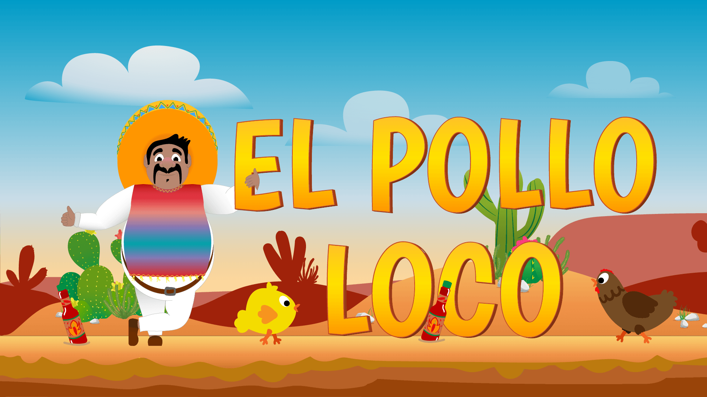

EL_POLLO_LOCO
=================

Kurze Beschreibung
------------------

EL_POLLO_LOCO ist ein kleines Browser-Game (HTML/CSS/JS), in dem ein Spieler einen Charakter steuert, sammelt und Hindernissen ausweicht. Das Projekt enthält alle Assets (Bilder, Audio, Schriftarten) und die Spiel-Logik in Vanilla JavaScript.

Schnellstart
-----------

1. Lokal öffnen

- Öffne index.html direkt im Browser (einige Browser blockieren lokale Dateizugriffe für Audio/Assets).

2. Lokaler Webserver (empfohlen)

- Mit Python 3:

```bash
python3 -m http.server 8000
# dann im Browser öffnen: http://localhost:8000
```

- Mit Node (http-server):

```bash
npx http-server -c-1
# dann im Browser öffnen: http://localhost:8080 (Standardport)
```

Projektstruktur (Kurzüberblick)
------------------------------

- `index.html` – Einstiegspunkt und Spiel-Canvas
- `style.css`, `control-btns.css`, `introductions.css`, `setting-btn.css` – Styles
- `js/` – Steuerungs- und Spiel-Initialisierungsskripte (z. B. `game.js`, `start.js`)
- `levels/`, `models/` – Spielklassen und Level-Logik
- `images/`, `audio/`, `fonts/` – Assets (Grafiken, Sounds, Schriftarten)

Steuerung
---------

- Pfeiltasten / WASD: Bewegung
- Leertaste: Springen
- Interaktions-Buttons: auf Touch/Onscreen-Buttons in der UI (bei Mobilgeräten)

Entwicklung
-----------

- Code ist in ES6 geschrieben, keine Build-Schritte nötig.
- Nutze einen lokalen Server (siehe oben), um CORS/Dateizugriffsprobleme mit Audio/Assets zu vermeiden.

Assets & Lizenz
---------------

- Schriftarten liegen in `fonts/` mit zugehöriger OFL-Datei (`OFL.txt`).
- Überprüfe `images/` und `audio/` auf Lizenzhinweise, bevor du Assets weiterverwendest.

Contributing
------------

- Bugfixes und kleine Verbesserungen per Pull Request.
- Bitte vor größeren Änderungen ein Issue öffnen, damit die Änderung abgestimmt werden kann.

Kontakt / Autor
----------------

Dieses Projekt wurde lokal entwickelt. Bei Fragen oder Wünschen zu Features gerne melden.
# El_Pollo_Loco

Screenshots
-----------

Startbildschirm:



Beispiel-Gameplay-Hintergrund:


Gewonnen-Bildschirm:


Lizenz-Hinweis (kurz)
---------------------

- Die Schriftarten im Ordner `fonts/` enthalten eine `OFL.txt` — das ist die SIL Open Font License (OFL) für die Schriftdateien.
- Für Bilder und Audio sind in diesem Repo keine allgemeinen Lizenzangaben zugeordnet; ich kann die Lizenz einzelner Assets nicht automatisch prüfen. Wenn du die Assets weitergeben oder veröffentlichen möchtest, solltest du deren Herkunft und Lizenz prüfen oder nur eigene/selbst erstellte Assets verwenden.
- Für den Quellcode des Spiels kann ich optional eine Licence-Datei hinzufügen (z. B. `MIT`). Soll ich das tun?
